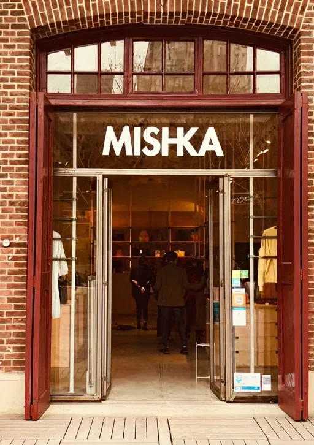

# Guía rápida de edición

Todo lo que se ve (textos, links e imágenes) está escrito en los HTML: la Home es `index.html` y las demás páginas están en `src/views/`. No hace falta tocar el JavaScript.

## Cambiar un texto

1. Abrí `index.html` con cualquier editor (por ejemplo, VS Code).
2. Buscá la frase con `Ctrl + F`, por ejemplo `Crecé sin límites`.
3. Cambiá el texto que está entre las etiquetas (`<h1>…</h1>`, `<p>…</p>`, etc.) y guardá.

Cada sección arranca con un comentario grande para ubicarla rápido:

```html
<!-- =====================================================
     HERO — título, bajada y video
     ===================================================== -->
```

Algunos detalles:
- En el título del hero, `<span class="subrayado">Crecé</span>` es la palabra con la línea coral debajo. Lo que va entre `<strong>` sale en negrita.
- En el diagrama de "Soluciones", cada módulo es un `<figure class="modulo">`. El nombre curvo va dentro de `<textPath>…</textPath>` y la ilustración en el ``.
- Las pestañas Gastronomía, Retail y Productividad muestran el bloque `data-panel` con el mismo nombre que su botón `data-tab`.
- En "Preguntas frecuentes", cada pregunta es un bloque `<details>`. El texto de `<summary>` es la pregunta y el `<p>` de abajo es la respuesta. Para agregar una pregunta, copiá un bloque `<details>…</details>` completo. Si le ponés `open`, arranca abierta.
- Los textos marcados con `<!-- TEXTO PROVISORIO -->` no estaban en el diseño: conviene reemplazarlos.

## Cambiar una imagen

Las imágenes están en `public/img/` (una carpeta por página). Para cambiar una:

1. Copiá la imagen nueva en esa carpeta (mejor si es `.webp`).
2. En `index.html`, cambiá el `src`:

```html

```

3. Actualizá también el `alt`, que es la descripción de la imagen para Google y para las personas ciegas.

## Cambiar un link

Cambiá el `href`. Por ejemplo, el video del hero:

```html
<a class="hero__video" href="#" …>   →   <a class="hero__video" href="https://youtube.com/…" …>
```

## Agregar un cliente al carrusel

Copiá un bloque `<li class="cliente">…</li>` completo, pegalo donde quieras que aparezca y cambiá la foto, el logo y el rubro. El cliente que tiene la clase `cliente--activo` es el destacado cuando carga la página. Con el mouse encima, se destaca el que estás señalando.

**Ojo con las rutas:** en `index.html` las imágenes se escriben `public/img/...`, pero en las páginas de `src/views/` se escriben `../../public/img/...`.

## Formularios (Pedí tu demo y Trabajá con nosotros)

- Todos los botones "Pedí tu demo" llevan a `src/views/demo.html` (teléfono, mail, ubicación y tipo de local; la demo se hace por Google Meet con un vendedor).
- "Trabaja con nosotros" es `src/views/trabaja-con-nosotros.html`, y solo se entra desde el footer.
- Para recibir los datos hay que conectar cada formulario (por ejemplo con Formspree): poné la dirección en `action=""` del `<form>`.

## Colores y tipografía

Están en `src/styles/variables.css`. Por ejemplo, si cambiás `--coral`, cambian todos los botones.

## Qué archivo toca cada cosa

- `index.html` y `src/views/*.html`: textos, imágenes, links y estructura de cada página.
- `src/styles/variables.css`: colores y medidas generales.
- `src/styles/components.css`: botones, menú y desplegables.
- `src/styles/layout.css`: diseño de la Home y del footer.
- `src/styles/segmento.css`: diseño de Gastronomía y Retail.
- `src/styles/paginas.css`: diseño de Sobre nosotros, Check, Clientes y las páginas en construcción.
- `src/styles/responsive.css`: cómo se ve en tablet y en celular.
- `src/controllers/controller.js`: menú, carrusel, pestañas y filtros. No tiene contenido.
